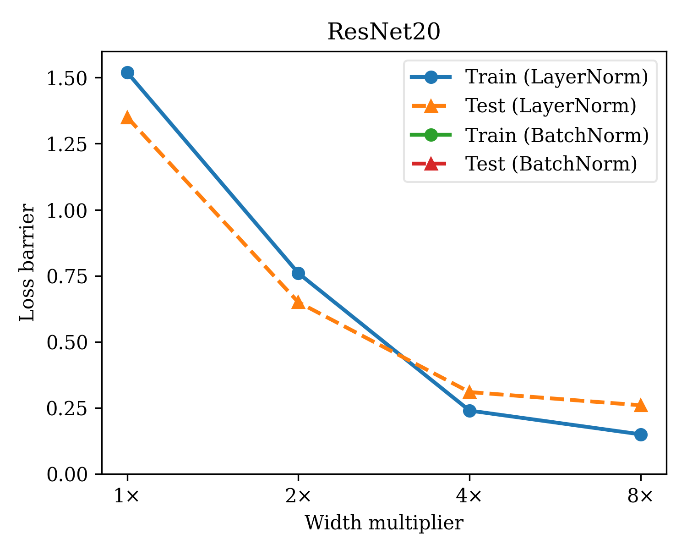
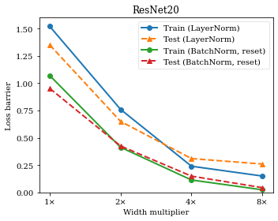

# Network-Permutations

Experiments in permutation search and interpolation methods for ResNets on CIFAR-10

All experiments use the [FFCV](https://github.com/libffcv/ffcv) dataloader to speed things up.
The script `write.py` should be run first in order to generate `.beton` files.
